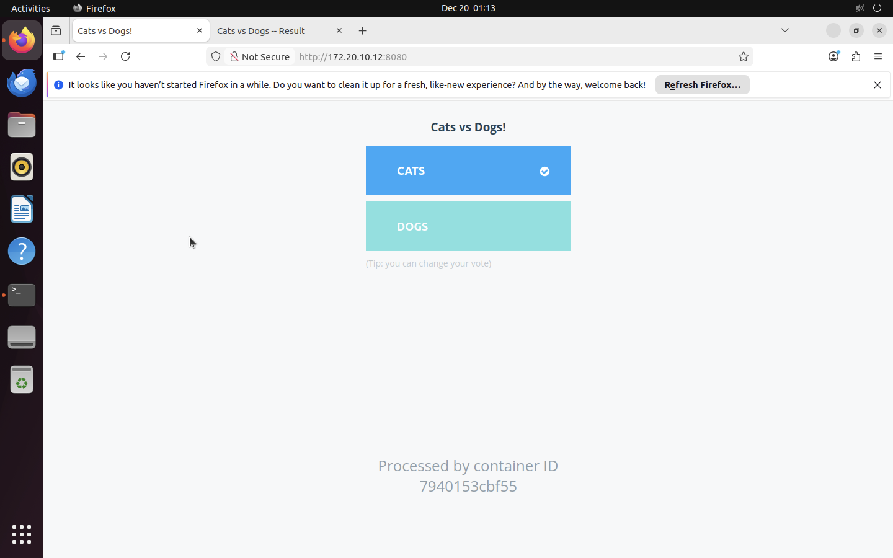
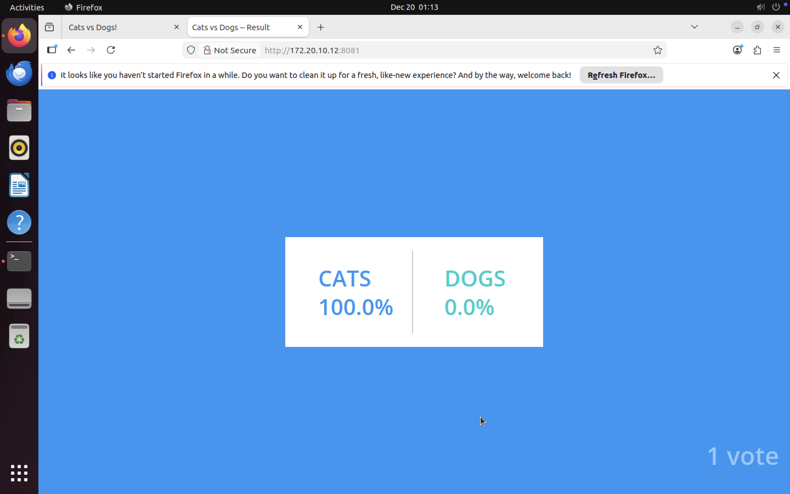

# Project 2- Docker Compose Lab


**Step 1: Uninstall unofficial Docker packages**<br>
I ran `sudo apt remove $(dpkg --get-selections docker.io docker-compose docker-compose-v2 docker-doc podman-docker containerd runc | cut -f1)` to remove unofficial Docker packages.

**Step 2: Set up Docker's `apt` repository**<br>
I ran these commands to add Docker's official GPG key.
```bash
sudo apt update
sudo apt install ca-certificates curl
sudo install -m 0755 -d /etc/apt/keyrings
sudo curl -fsSL https://download.docker.com/linux/ubuntu/gpg -o /etc/apt/keyrings/docker.asc
sudo chmod a+r /etc/apt/keyrings/docker.asc
```

Then I added the repository to Apt sources with 
````bash
sudo tee /etc/apt/sources.list.d/docker.sources <<EOF
Types: deb
URIs: https://download.docker.com/linux/ubuntu
Suites: $(. /etc/os-release && echo "${UBUNTU_CODENAME:-$VERSION_CODENAME}")
Components: stable
Signed-By: /etc/apt/keyrings/docker.asc
EOF

sudo apt update
````

**Step 3: Install Docker packages**<br>
I installed the official Docker packages using `sudo apt install docker-ce docker-ce-cli containerd.io docker-buildx-plugin docker-compose-plugin`.

**Step 4: Set Up Application of Choice**<br>
I decided to install the [Example Voting App](https://github.com/dockersamples/example-voting-app). First, I cloned the repository with `https://github.com/dockersamples/example-voting-app.git`. Then I changed directories into it. To build necessary images and start services, I ran `sudo docker compose up --build`, but it didn't work.

````bash
# version is now using "compose spec"
# v2 and v3 are now combined!
# docker-compose v1.27+ required

services:
  vote:
    build: 
      context: ./vote
      target: dev
    depends_on:
      redis:
        condition: service_healthy
    healthcheck: 
      test: ["CMD", "curl", "-f", "http://localhost"]
      interval: 15s
      timeout: 5s
      retries: 3
      start_period: 10s
    volumes:
     - ./vote:/usr/local/app
    ports:
      - "8080:80"
    networks:
      - front-tier
      - back-tier

  result:
    build: ./result
    # use nodemon rather than node for local dev
    entrypoint: nodemon --inspect=0.0.0.0 server.js
    depends_on:
      db:
        condition: service_healthy 
    volumes:
      - ./result:/usr/local/app
    ports:
      - "8081:80"
      - "127.0.0.1:9229:9229"
    networks:
      - front-tier
      - back-tier

  worker:
    build:
      context: ./worker
    depends_on:
      redis:
        condition: service_healthy 
      db:
        condition: service_healthy 
    networks:
      - back-tier

  redis:
    image: redis:alpine
    volumes:
      - "./healthchecks:/healthchecks"
    healthcheck:
      test: /healthchecks/redis.sh
      interval: "5s"
    networks:
      - back-tier

  db:
    image: postgres:15-alpine
    environment:
      POSTGRES_USER: "postgres"
      POSTGRES_PASSWORD: "postgres"
    volumes:
      - "db-data:/var/lib/postgresql/data"
      - "./healthchecks:/healthchecks"
    healthcheck:
      test: /healthchecks/postgres.sh
      interval: "5s"
    networks:
      - back-tier

  # this service runs once to seed the database with votes
  # it won't run unless you specify the "seed" profile
  # docker compose --profile seed up -d
  seed:
    build: ./seed-data
    profiles: ["seed"]
    depends_on:
      vote:
        condition: service_healthy 
    networks:
      - front-tier
    restart: "no"

volumes:
  db-data:

networks:
  front-tier:
  back-tier:
````


To fix the issue, I ran ip link and saw my MTU was too large. To reduce the size I edited the `/etc/docker.daemon.json` to include "mtu": 1300. I tried restarting Docker and testing it with `sudo docker run hello-world` but it still wasn't working. 

Maybe it was because I was doing this project in a car using a hotspot? So I closed my VM, and changed my Network settings from Shared Network to Bridged(Advanced). Testing `sudo docker run hello-world` after this worked! So I reran `sudo docker compose up --build`. Then I opened up Firefox, typed in `http://172.20.10.12:8080` in one tab to access the voting interface, and typed in `http://172.20.10.12:8081` in another tab to access the results dashboard. 

The result of these two web browser searches were:

(I voted for Cats)

and

