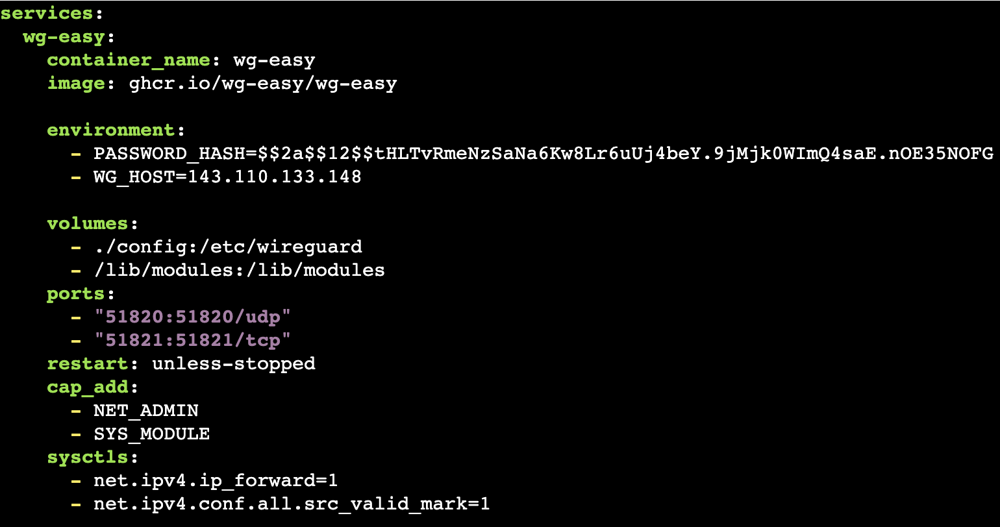
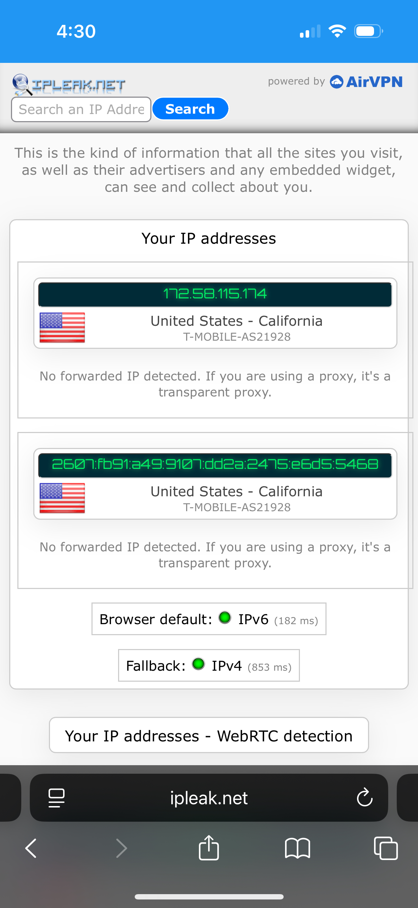
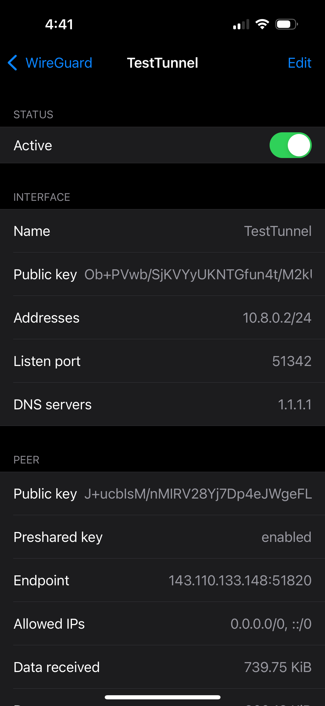
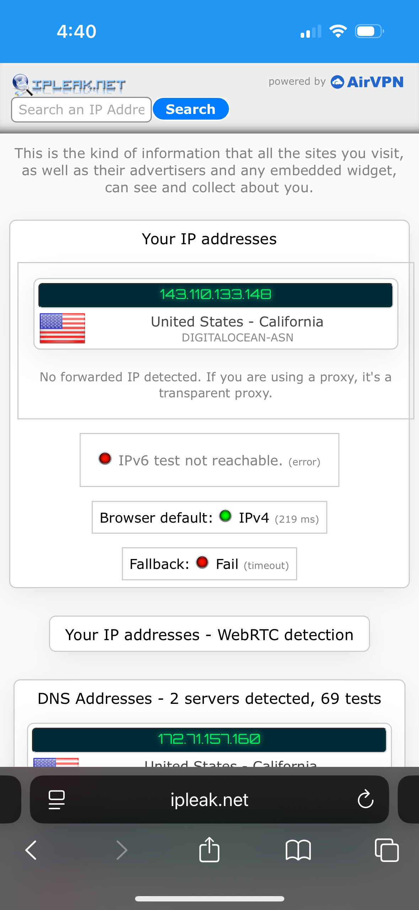
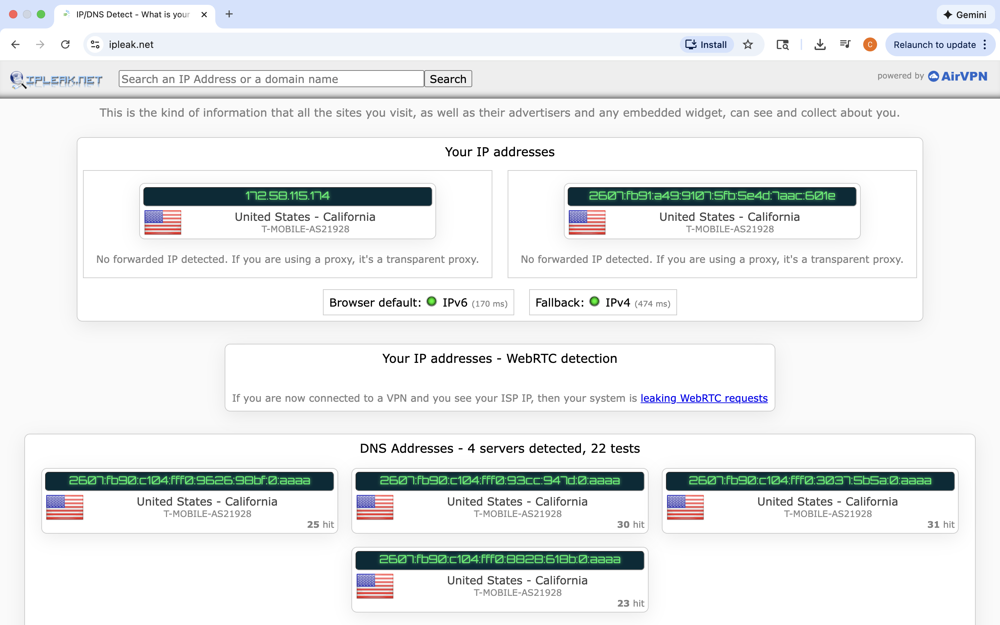
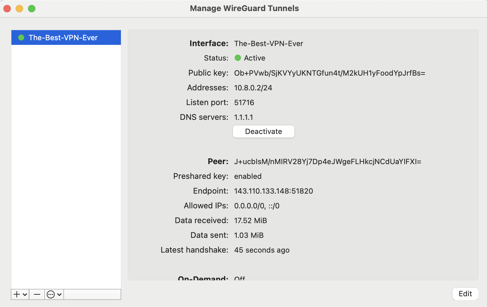
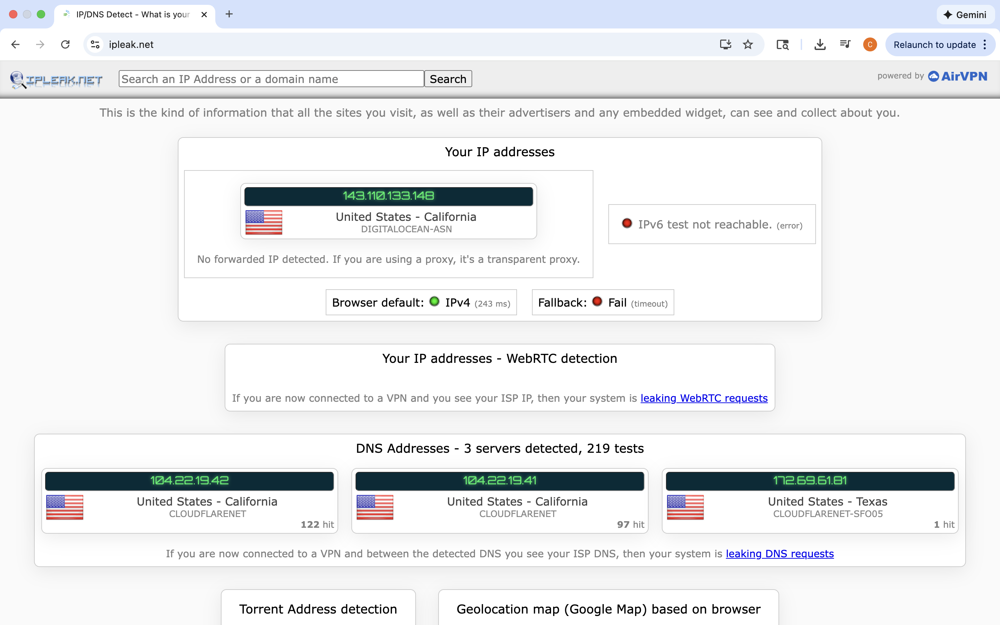

# Project 3- Wireguard Lab

**Step 1: Create a Digital Ocean Account** 
I set up an account using https://m.do.co/c/d33d59113ab6.

**Step 2: Create an Ubuntu 24.04 Droplet** 
I selected the Region and Datacenter closest to me, San Francisco.

I chose an Ubuntu 24.04 Image.

I selected a Basic Droplet Type, a Regular CPU with a regular SSD, and the $24/mo plan.

To authenticate, I chose to use a password.

**Step 3: Install Docker** 
I installed Docker using the command `curl -sSL https://get.docker.com | sh`. 

**Step 4: Create Directory for Docker Compose File** 
I created a directory to store the Docker Compose file to run WireGuard using `sudo mkdir -p /opt/stacks/wireguard` and changed directories into it.

**Step 5: Generate a WG-Easy Password Hash** 
I wanted to use the WG-Easy container to manage my VPN through a web interface. To generate a hash for the password I intend to use to access the WG-Easy web interface, I ran the command `docker run --rm -it ghcr.io/wg-easy/wg-easy wgpw '<PASSWORD>'`, replacing `<PASSWORD>` with an actual password I created.

**Step 6: Create the Docker Compose File** 
With nano, I wrote the `compose.yaml` file. In it, I wrote

**Step 8: Start up the WireGuard Container** 
To start up WireGuard, I ran `docker compose up -d`.

**Step 9: Access the WireGuard Docker Container Web Interface** 
To access the WG-Easy web interface, I went to `http://<IPADDRESS>:51821`, replacing `<IPADDRESS>` with the IP address of my Ubuntu image.

I logged into the web interface using the password I set earlier. Then I created a new client and named it.

**Step 10: Testing on Mobile Device** 
I downloaded the WireGuard app on my phone. Then I added a tunnel using the `Create from QR code` option. I scanned the QR code of my client.

Before I activated the VPN tunnel, my IP address was:

Once I activated it on the WireGuard application interface,

my IP address was:

**Step 11: Testing on Laptop** 
I downloaded the configuration files for my VPN. I installed WireGuard on my MacBook. Then I imported a tunnel from the configuration files.

Before I activated the VPN tunnel, my IP address was:

Once I activated it on the WireGuard application interface,

my IP address was:

